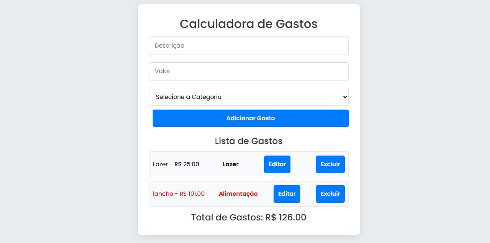

# Calculadora de Gastos

Esta é uma simples aplicação web para calcular e gerenciar gastos diários. O projeto foi desenvolvido utilizando HTML, CSS e JavaScript, e tem como objetivo ajudar os usuários a manter um controle sobre suas despesas.

## Funcionalidades

- **Cadastro de Gastos**: Permite ao usuário adicionar um gasto, incluindo descrição, valor e categoria (ex: Transporte, Alimentação).
- **Listagem de Gastos**: Exibe todos os gastos cadastrados em uma lista, com opção de editar ou excluir.
- **Destaque para Gastos Altos**: Os gastos com valor superior a 100 são destacados em vermelho para fácil identificação.
- **Soma Total dos Gastos**: Exibe o total de todos os gastos cadastrados.

## Tecnologias Utilizadas

- **HTML**: Estruturação do conteúdo da página.
- **CSS**: Estilização e layout da aplicação.
- **JavaScript**: Lógica da aplicação e manipulação do DOM.
